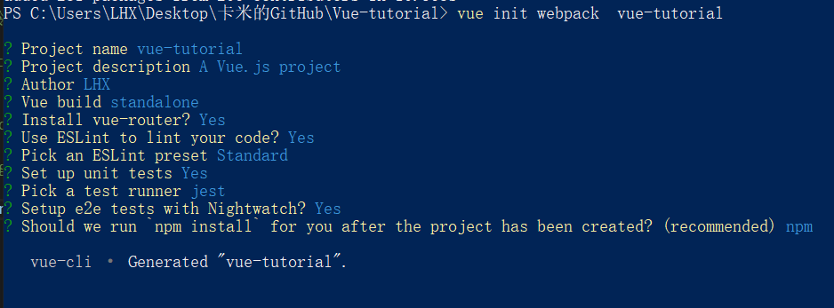
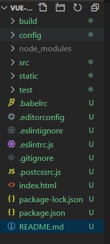
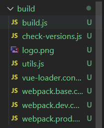

# vue-tutorial

> vue项目实践

## 创建项目
> 在 vue 的安装与介绍的学习中，我已经详细的描述了搭建 vue 项目的过程，而 vue-project 这个项目就是用 vue init 指令去搭建以 webpack 为模板的项目，区别于 vue create 指令，vue init 会多出 build 和 config 文件夹。
```js
// 先全局安装 cli-init 指令才可以使用 vue init
npm i -g @vue/cli-init
// 格式：init [options] <template> <app-name>
/*
Options:
  -c, --clone  Use git clone when fetching remote template
  --offline    Use cached template
  -h, --help   output usage information
*/
vue init webpack vue-tutorial
``` 
然后根据自己的需求去设置项目的配置

#### 初始化后的根目录的文件夹结构如下：
```
├─build         // 对 webpack 开发和打包的相关设置，包括入口文件、输出文件、使用的模块等
├─config        // 此目录下是项目的环境常亮配置，提供给build中的文件使用
├─node_modules
├─src           // 项目的源码所在目录
├─static        // 项目的静态资源文件，其中的 .gitkeep文件是git使用的一个占位文件
└─test          // 测试代码
```


<hr/>

#### 根目录文件说明
##### .babelrc文件
es6特性浏览器还没有全部支持，但是使用es6是大势所趋，所以babel应运而生，用来将es6代码转换成浏览器能够识别的代码，用来兼容绝大多数的主流浏览器。在项目工程脚手架中，一般会使用.babelrc文件，通过配置一些参数配合webpack进行打包压缩。
##### .editorconfig文件
描述：配置文件以及编码等信息，代码的规范文件，规定使用空格或 tab 缩进，缩进的长度是两位还是四位之类的代码风格，使用的话需要在编辑器里下载对应的插件；
##### .gitignore文件
git 忽略上传提交的文件
##### .postcssrc.js文件
指定使用的 css 预编译器，里面默认配置了 autoprefixer ，自动补全浏览器前缀；
##### .eslintrc.js文件
设置 eslint 配置

<hr/>

#### config文件夹目录下的文件说明
##### dev.env.js文件
对应开发环境下的环境变量
##### prod.env.js文件
对应生产环境下的环境变量
##### test.env.js文件
对应测试环境下的环境变量
> 上诉的环境变量最后都会根据 process.env.xxx 形式在整个项目中获取。
在 webpack.prod.conf.js 文件中会把上诉自定义的环境变量以 process.env 的 plugin 形式加入进去，不难看出，最后以生产环境 prod.env.js 为本，开发环境 dev.env.js 依赖修改prod.env.js文件，测试环境 test.env.js 则依赖开发环境，所以最终只需确认生产环境 prod.env.js 的环境变量即可。 
<hr/>

#### build文件夹目录下的文件说明


##### build.js文件
构建环境下的配置:
loading动画、删除创建目标文件夹、webpack编译、输出信息
##### check-versions.js文件
node和npm的版本检查
##### utils.js文件
配置静态资源路径；
生成cssLoaders用于加载.vue文件中的样式；
生成styleLoaders用于加载不在.vue文件中的单独存在的样式文件
##### vue-loader.conf.js文件
设置 vue-loader 例如将 utils.js 文件中配置好的 cssLoader 载入
##### webpack.base.conf.js文件
基本的webpack配置
  配置webpack编译入口
  配置webpack输出路径和命名规则
  配置模块resolve规则
  配置不同类型模块的处理规则
##### webpack.dev.conf.js文件
开发环境配置
  在base.conf基础进一步完善
  将hot-reload相关的代码添加到entry chunks
  使用styleLoaders
  配置Source Maps
  配置webpack插件
##### webpack.prod.conf.js文件
生产环境配置
  在base.conf基础进一步完善
  合并基础webpack配置
  使用styleLoaders
  配置webpack输出
  配置webpack插件
  gzip模式下的webpack插件配置
  webpack-bundle分析

> 部分具体的细节可查看本项目的对应文件的代码和注释

<hr/>

## Build Setup

``` bash
# install dependencies
npm install

# serve with hot reload at localhost:8080
npm run dev

# build for production with minification
npm run build

# build for production and view the bundle analyzer report
npm run build --report

# run unit tests
npm run unit

# run e2e tests
npm run e2e

# run all tests
npm test
```

For a detailed explanation on how things work, check out the [guide](http://vuejs-templates.github.io/webpack/) and [docs for vue-loader](http://vuejs.github.io/vue-loader).
