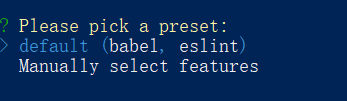
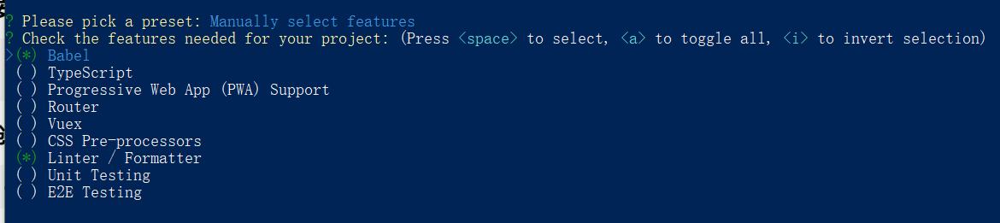
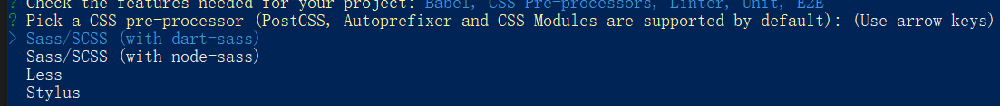
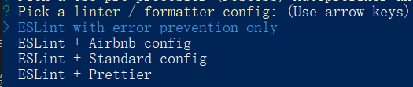
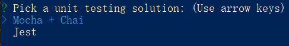
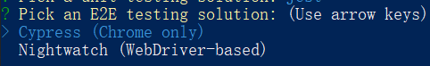
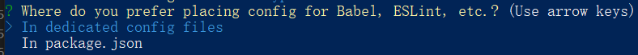

### vue的安装与引入
**注意**：Vue使用了 IE8 无法模拟的 ECMAScript 5 特性，不支持 IE8 及以下版本，但它支持所有兼容 ECMASCript 5 的浏览器。
**（1）通过 script 标签引入**
- 直接在官网下载 vue.js 并用 script 标签引入，Vue 会被注册为一个全局的变量
- CDN形式，也是通过 script 标签引入线上的 vue.js 。CDN 是构建现有网络基础之上的智能虚拟网络，依靠部署在各地的边缘服务器，通过负载均衡、内容分发、调度等功能模块，使用户就近获取所需内容，降低网络堵塞，提高用户访问响应速度和命中率。CDN 的关键技术主要由内容存储和分发技术。

**（2）webpack 搭建vue环境**
- 直接 ```$npm install vue ```，通过 npm 安装 vue，通过 webpack 等打包器配合使用。
- 使用 vue-cli 脚手架快速搭建 vue 项目

**以下将是最常用的通过脚手架搭建vue项目，初学者建议先通过自己搭配webpack环境搭建项目**。
#### 1、安装 Node
Node 版本要求：
vue 脚手架3.0版本以上需要 Node8.9 或更高版本，直接去 node 官网下载，可打开命令窗口，使用下面命令检测你的 node 版本：
```
node -v
``` 
#### 2、安装vue-cli
```js
npm install -g @vue/cli
vue --version //查询vue版本 
```
#### 3、创建项目
```js
vue create my-app
```
执行上诉命令后会出现以下界面：

开始只有两个选项：default（默认配置） 和 Manually select features（手动配置），默认配置 只有 babel 和 eslint 其它的都要自己另外安装配置，为了更清楚的跟着脚手架安装项目完整的配置，我们选择第二项 手动配置。
选择第二项手动配置后，出现以下页面：

可通过空格去标记是否选择配置项，然后回车确定。
每个配置选项对应的意义：
```js
 (*) Babel
 ( ) TypeScript // 支持使用 TypeScript 书写源码
 ( ) Progressive Web App (PWA) Support  // PWA 支持
 ( ) Router // 支持 vue-router
 ( ) Vuex // 支持 vuex
 ( ) CSS Pre-processors  // 支持 CSS 预处理器。
 (*) Linter / Formatter  // 支持代码风格检查和格式化。
 ( ) Unit Testing // 支持单元测试。
 ( ) E2E Testing // 支持端对端测试。
```
**配置项说明**
1、CSS Pre-processors（css 的预处理）

选择一个作为项目的 css预处理 标准

2、Linter / Formatter （代码风格、格式校验）

```js
ESLint with error prevention only  //仅错误预防
ESLint + Airbnb config   //Airbnb配置
ESLint + Standard config //标准配置
```
选择之后会出现：
```js
选择lint方式：Pick additional lint features
选项：
Lint on save //保存时检查
Lint and fix on commit //提交时检查
```

3、Unit Testing（单元测试）


4、E2E Testing （E2E，End To End，即端对端测试）


5、选择 Babel、PostCSS、ESLint 等自定义配置的存放位置

```js
In dedicated config files //在专用的配置文件中
In package.json //在package.json
```

6、将此次配置作为将来项目的预设置吗？


7、完成以上操作之后就可以成功创建项目，输入以下命令启动项目
```js
cd my-app
npm run serve
```
#### 4、搭建项目架构
vue项目创建好后，只有简单的架构以及创建时安装的一些配置的配置文件，其它完整的架构还需根据项目需求去架构，以下是一个项目目录结构参考：
```js
├── build                      # 构建相关
├── mock                       # 项目mock 模拟数据
├── plop-templates             # 基本模板
├── public                     # 静态资源
│   │── favicon.ico            # favicon图标
│   └── index.html             # html模板
├── src                        # 源代码
│   ├── api                    # 所有请求
│   ├── assets                 # 主题 字体等静态资源
│   ├── components             # 全局公用组件
│   ├── directive              # 全局指令
│   ├── filters                # 全局 filter
│   ├── icons                  # 项目所有 svg icons
│   ├── lang                   # 国际化 language
│   ├── layout                 # 全局 layout
│   ├── router                 # 路由
│   ├── store                  # 全局 store管理
│   ├── styles                 # 全局样式
│   ├── utils                  # 全局公用方法
│   ├── vendor                 # 公用vendor
│   ├── views                  # views 所有页面
│   ├── App.vue                # 入口页面
│   ├── main.js                # 入口文件 加载组件 初始化等
│   └── permission.js          # 权限管理
├── tests                      # 测试
├── .env.xxx                   # 环境变量配置
├── .eslintrc.js               # eslint 配置项
├── .babelrc                   # babel-loader 配置
├── .travis.yml                # 自动化CI配置
├── vue.config.js              # vue-cli 配置
├── postcss.config.js          # postcss 配置
└── package.json               # package.json
```